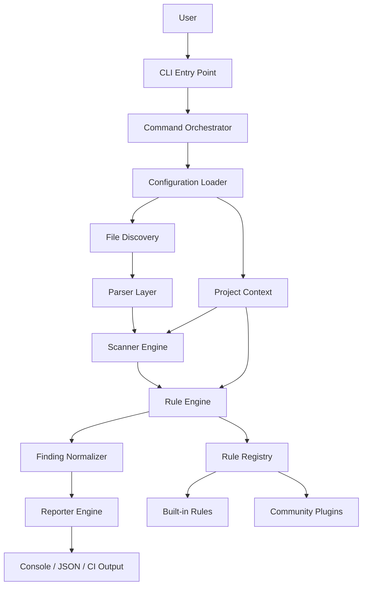
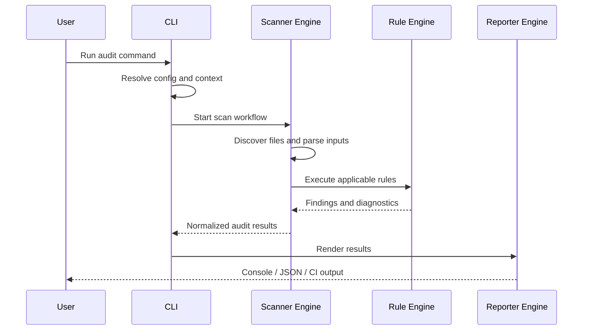

# ui-audit Architecture Design

## 1. Purpose

This document defines the internal architecture for ui-audit, a production-grade open-source CLI for auditing frontend projects. The design is intentionally layered and modular so the tool can scale from a small set of initial checks to hundreds of audit rules without becoming brittle or difficult to maintain.

This document focuses on architecture and boundaries. It does not prescribe implementation details for scanning logic itself.

## 2. Design Goals

- Support a large and growing rule catalog without architectural sprawl
- Keep the CLI fast enough for local development and CI use
- Preserve a clear separation between discovery, parsing, evaluation, and reporting
- Make it straightforward for contributors to add new rules and community plugins
- Keep the system extensible for future AI-assisted analysis without coupling core logic to AI services
- Preserve a strong safety posture by avoiding execution of user project code

## 3. High-Level Architecture Diagram

## 4. Core System Responsibilities

The system is divided into a small number of well-defined responsibilities:

- CLI layer: parse user input, validate options, and initiate workflows
- Configuration layer: resolve defaults, project settings, and rule enablement
- Discovery layer: locate candidate files and build a deterministic file inventory
- Parsing layer: convert source files into structured intermediate representations
- Scanner engine: coordinate the scanning workflow across files and rules
- Rule engine: manage rule execution, context, and result collection
- Reporting layer: render findings in human-readable and machine-readable formats
- Plugin layer: extend the platform with external rules and reporters safely

This separation ensures that each subsystem has a single primary concern.

## 5. CLI Flow

The CLI should follow a consistent execution flow:

1. Parse command-line arguments and subcommands
2. Resolve configuration from project files, environment variables, and CLI overrides
3. Create a project context containing root path, target files, and enabled rules
4. Discover candidate files based on include and exclude patterns
5. Parse the relevant files into a normalized internal model
6. Run the scan workflow through the scanner engine
7. Evaluate applicable rules and aggregate findings
8. Render results using the selected reporter
9. Return an appropriate exit code based on severity and strictness settings

The command surface should remain thin. Commands should orchestrate workflows rather than contain business logic directly.

## 6. Scanner Engine

The scanner engine is the orchestration layer for the audit process. It should not embed domain-specific rule logic directly; instead, it should coordinate the pipeline:

- Build a file inventory
- Normalize parsed documents
- Dispatch work to the rule engine
- Aggregate outcomes and produce a unified result set
- Manage execution order, concurrency, and cancellation

The scanner engine should be designed as a pipeline with clear stages:

- discovery stage
- parsing stage
- evaluation stage
- normalization stage
- reporting stage

This architecture makes it easier to add future capabilities such as incremental scans, parallel execution, and rule-specific precomputations.

## 7. File Discovery

File discovery should be treated as a separate subsystem because it has its own concerns: performance, include/exclude semantics, and platform-specific path handling.

Responsibilities:

- Determine the scan root and target directories
- Apply ignore patterns such as node_modules, dist, coverage, and build artifacts
- Support explicit globs and default project heuristics
- Produce a stable file inventory with metadata for each file
- Avoid scanning irrelevant files early in the process

The discovery layer should emit a normalized file list that the parser layer can consume. It should be deterministic so that results are reproducible across runs.

## 8. Parser Layer

The parser layer converts source files into a structured representation suitable for rule evaluation. It should be abstracted so that rule implementations do not depend on raw text or framework-specific details.

Suggested parser strategy:

- Source parsers for JavaScript, TypeScript, JSX, TSX, and related syntax
- Markup parsers for HTML and templated UI languages
- Stylesheet parsers for CSS and preprocessors
- Configuration parsers for JSON, YAML, and project config files
- Fallback text parsers for unsupported or unstructured files

Each parser should produce a normalized document model with:

- file path
- language or framework hint
- syntax tree or equivalent structured data
- metadata such as imports, components, or DOM-like structure where relevant

The parser layer should be extensible and should enable future framework-specific adapters without changing the rule engine contract.

## 9. Rule Engine

The rule engine is the heart of the audit system. It should manage rule registration, selection, execution, and result normalization.

Core responsibilities:

- Register built-in and plugin-provided rules
- Validate rule metadata and configuration
- Select applicable rules for the current project and file set
- Execute rules against the parsed project model
- Collect findings and attach common metadata such as severity, category, and remediation guidance

Rules should be treated as first-class domain objects with a stable contract. Each rule should declare:

- identifier
- description
- category
- severity
- supported file types or scopes
- configuration schema
- evaluation behavior

The rule engine should keep rule implementations independent from CLI concerns and reporter concerns.

## 10. Rule Lifecycle

A well-defined rule lifecycle is important for maintainability as the number of rules grows.

Recommended lifecycle:

1. Registration: a rule is discovered and registered with the engine
2. Validation: metadata and configuration are validated
3. Activation: the rule is enabled for the current run based on configuration
4. Execution: the rule evaluates the relevant data model
5. Normalization: findings are converted into the shared result format
6. Reporting: findings are emitted through the reporter pipeline
7. Observability: execution metrics and diagnostics are captured for troubleshooting

This lifecycle makes it easier to add instrumentation, skip invalid rules gracefully, and reason about failures when a single rule breaks.

## 11. Reporter Engine

The reporter engine should be responsible for presentation only. It should consume normalized findings and render them in one or more output forms.

Planned reporter modes:

- terminal output for local use
- JSON output for CI and automation
- SARIF or related machine-readable output for security and IDE integration
- future HTML or web-based dashboards

The reporter layer should be decoupled from the rule engine so that new output formats can be added without changing rule logic.

A shared finding schema should include:

- rule identifier
- severity
- message
- location
- remediation suggestions
- metadata for debugging or future enrichment

## 12. Plugin Architecture

The architecture should support an explicit plugin model for community contributions.

Recommended plugin model:

- Plugins are packaged as standalone modules or npm packages
- Each plugin declares a manifest describing its capabilities and dependencies
- Plugins can contribute rules, reporters, parsers, or configuration extensions
- Plugins are loaded through a controlled registry rather than ad hoc imports
- Plugin loading should be opt-in and version-aware

The plugin boundary must be strict. Community plugins should not be able to bypass core safety constraints or silently mutate the scanning pipeline in unpredictable ways.

A plugin should interact with the system through stable contracts rather than direct access to internal implementation details.

## 13. Configuration System

Configuration should be hierarchical and predictable.

Suggested precedence:

1. CLI flags
2. Environment variables
3. Project-level config file
4. Default configuration

Supported configuration concepts:

- enabled and disabled rules
- severity overrides
- scan root and include/exclude paths
- reporter selection
- plugin configuration
- strictness and fail-on-severity behavior

Configuration should be validated against a schema and should be versioned so that breaking changes can be introduced safely.

## 14. Future AI Integration

AI capabilities should be introduced as an optional layer rather than a core dependency.

The architecture should support future features such as:

- natural-language explanations of findings
- suggested fixes or remediation text
- rule generation assistance for maintainers
- severity triage support for large audits

To preserve trust and safety, AI integration should:

- remain opt-in
- operate on sanitized, local context only unless explicitly configured otherwise
- not replace deterministic rule evaluation
- be isolated behind an interface so that multiple providers can be supported later

This ensures that the core audit engine remains deterministic, explainable, and reliable.

## 15. Error Handling Strategy

Error handling should be designed to be resilient and observable.

Recommended strategy:

- Classify errors into configuration, filesystem, parser, rule, and reporting failures
- Continue processing where possible rather than failing the entire run on a single rule error
- Emit structured diagnostics for failed files or rules
- Return non-zero exit codes for fatal issues and optionally for rule violations depending on policy
- Keep partial results available even when some subsystems fail

The system should distinguish between recoverable and fatal errors so that users receive actionable feedback without losing the complete context of the run.

## 16. Performance Strategy

Performance should be treated as a first-class architectural concern because the tool may eventually scan large repositories.

Recommended approach:

- Discover files once and reuse the inventory for the run
- Support parallel execution of independent work where safe
- Avoid reparsing files unnecessarily
- Cache intermediate parse results when possible
- Use rule budgets and timeout guards to prevent runaway evaluations
- Prefer lazy loading for parsers and plugins that are not needed for the current run

The architecture should be designed so that performance optimizations can be layered in later without changing the rule contract.

## 17. Folder Responsibilities

The repository layout already suggests a useful boundary structure. The architecture should preserve and extend it as follows:

- src/cli.ts: CLI entry point and command registration
- src/commands/: high-level command workflows
- src/scanners/: scan orchestration and file traversal
- src/parsers/: parser adapters and normalization logic
- src/rules/: rule definitions and metadata
- src/analyzers/: result normalization and enrichment
- src/reporters/: output formatting and reporting backends
- src/types/: shared domain types and contracts
- src/utils/: cross-cutting helpers and infrastructure utilities
- tests/: behavioral tests for the CLI and its core workflows

If the project grows further, a dedicated src/plugins/ or src/extensions/ folder may be added for community extension loading.

## 18. Sequence Diagram

## 19. Design Decisions

The following design decisions are central to the architecture:

- Separate orchestration from rule implementation to keep the system understandable
- Use a normalized internal model so rules are not tightly coupled to source syntax
- Keep reporters output-focused and independent from evaluation logic
- Treat plugins as extensions behind explicit contracts and versioning
- Preserve deterministic behavior and local-first execution as a guiding principle

These decisions help keep the system maintainable even as the number of rules and output formats expands.

## 20. Why This Architecture Was Chosen

This architecture was chosen because it balances three priorities that matter for an open-source CLI:

- maintainability: responsibilities are clearly separated
- extensibility: new rules and reporter formats can be added without rewriting the core pipeline
- reliability: the system remains predictable, testable, and safe for real-world use

It also matches the likely evolution of the project: a small initial implementation can grow into a broad rule engine without introducing a monolithic design.

## 21. Extension Strategy for Community Plugins

To make the project attractive to contributors and the broader ecosystem, the architecture should support a clear plugin path:

1. Define a stable plugin contract and versioning policy
2. Allow plugins to contribute rules, reporters, or parser adapters
3. Provide a local development workflow for testing third-party plugins
4. Encourage plugin authors to ship tests and documentation with their packages
5. Offer a safe discovery mechanism for plugins configured in project settings

The plugin system should be designed for trust and clarity. Community extensions should feel like a first-class part of the platform rather than an afterthought.

## 22. Recommended Maintainability Improvements

The architecture will be easier to maintain if the team adopts a few practical habits early:

- Define stable interfaces for rules, parsers, and reporters so that internal changes do not cascade widely
- Keep rules stateless and side-effect free wherever possible
- Introduce a shared result model and avoid ad hoc finding shapes
- Provide fixture-based tests for each rule category and parser adapter
- Add structured logging and metrics from the start, even if the initial implementation is simple
- Keep the plugin boundary explicit and versioned to prevent internal coupling
- Prefer composition over deep inheritance and avoid making the scanner engine responsible for rule-specific concerns

These choices will reduce technical debt as the project grows.

## 23. Future Roadmap

The architecture should support a phased roadmap:

- Phase 1: CLI foundation, config loading, file discovery, and core reporting
- Phase 2: Initial built-in rule set and parser adapters for common frontend stacks
- Phase 3: Plugin ecosystem and community contribution workflow
- Phase 4: Structured reporting formats and CI integration
- Phase 5: Optional AI-assisted interpretation and remediation suggestions

This roadmap keeps the initial scope manageable while laying the groundwork for long-term growth.
