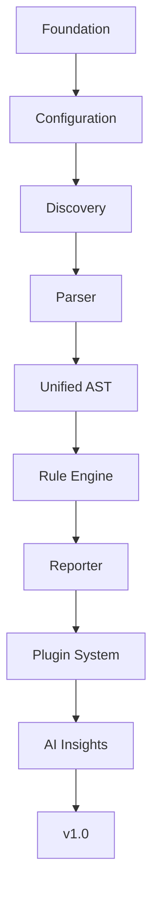

# Project Vision

Status: Accepted  
Author: ui-audit maintainers  
Created: 2026-07-11  
Discussion: docs/architecture.md

## Summary

ui-audit is a production-grade developer tool for auditing frontend projects for
accessibility, performance, maintainability, and user-interface quality issues.
It aims to combine deterministic static analysis, framework-aware parsing,
actionable reporting, and an extensible plugin ecosystem.

The project should feel familiar to users of TypeScript, ESLint, Vite, and other
modern frontend tools: fast by default, predictable in CI, explicit in
configuration, and designed around stable public contracts.

## Motivation

Frontend teams often discover UI regressions late: during manual QA, design
review, accessibility audits, or after users report issues. Many of these
problems are detectable earlier through static analysis and project-aware
heuristics, but existing tooling is fragmented across linters, framework-specific
plugins, browser audits, and custom scripts.

ui-audit exists to provide a focused audit layer for UI quality. It should
identify issues that matter to users, explain them clearly to developers, and
integrate naturally into local development and CI.

## Long-Term Goals

- Provide a reliable audit pipeline from configuration to reporting.
- Support React, Vue, HTML, and additional frontend ecosystems over time.
- Offer a stable rule authoring model for maintainers and plugin authors.
- Keep deterministic analysis at the core, with optional AI assistance layered on
  top.
- Make findings actionable through clear severity, location, context, and
  remediation guidance.
- Scale from small projects to large monorepos without surprising performance
  cliffs.
- Build a contributor-friendly architecture that rewards small, well-scoped
  extensions.

## Design Philosophy

ui-audit should be modular rather than monolithic. Each subsystem should have one
primary responsibility, stable inputs, and stable outputs. The CLI should
orchestrate; it should not own business logic. Rule authors should work against
interfaces; they should not need to understand filesystem traversal or reporting
internals.

The project should optimize for boring reliability in the core and innovation at
the edges. A conservative core makes plugin experimentation safer.

## Core Principles

- **Deterministic first:** Findings should be reproducible across local and CI
  environments.
- **Framework agnostic core:** React, Vue, HTML, and future frameworks should
  share common contracts where possible.
- **Explicit configuration:** Defaults should be useful, but user intent should
  always be visible and validated.
- **Interface-first design:** Public contracts should precede implementation
  details.
- **Separation of concerns:** Discovery, parsing, evaluation, and reporting are
  distinct stages.
- **Safe extensibility:** Plugins should extend through stable interfaces and
  controlled loading boundaries.
- **Actionable output:** Reports should help users decide what to fix and why.

## Roadmap

### Foundation

Establish core contracts, repository standards, testing expectations, and
documentation practices.

### Configuration

Provide a typed configuration system with defaults, validation, and predictable
load order.

### Discovery

Build a deterministic file discovery layer that identifies candidate project
files while ignoring generated and dependency directories.

### Parser

Introduce language and framework parsers that convert source files into
structured intermediate representations.

### Unified AST

Normalize parser output into a model that rules can evaluate without coupling to
framework-specific parser internals.

### Rule Engine

Coordinate rule registration, activation, evaluation, error isolation, and result
normalization.

### Reporter

Render findings for humans and machines, including terminal, JSON, and future CI
or editor-oriented formats.

### Plugin System

Allow external packages to contribute rules, parsers, reporters, and
configuration extensions through stable contracts.

### AI Insights

Add optional AI-assisted explanations, triage, and remediation suggestions while
keeping deterministic rule evaluation authoritative.

### v1.0

Stabilize public APIs, configuration semantics, plugin contracts, and supported
report formats.

## Non-goals

- Replacing TypeScript, ESLint, browser-based audits, or framework compilers.
- Executing user application code during normal audits.
- Making AI a required dependency for core analysis.
- Providing complete coverage for every frontend framework in the initial
  release.

## Future Possibilities

- Incremental audits with cache-aware invalidation.
- Monorepo-aware project graph discovery.
- SARIF output for code scanning integrations.
- Editor integrations powered by the same core engine.
- Organization-level rule presets and governance policies.
