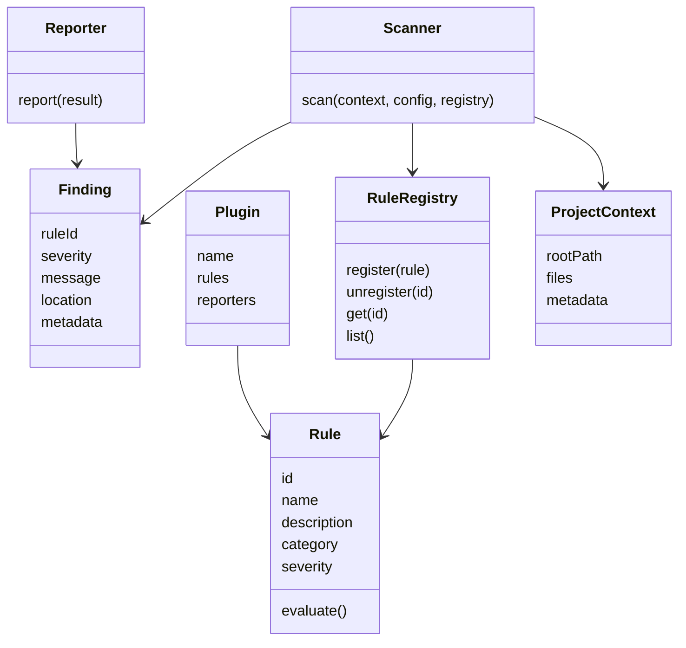

# Core Contracts

Status: Accepted  
Author: ui-audit maintainers  
Created: 2026-07-11  
Discussion: docs/architecture.md

## Summary

ui-audit defines its foundation through explicit TypeScript contracts for rules,
findings, registries, scanners, reporters, plugins, and project context. These
interfaces create stable boundaries between subsystems and allow the project to
grow without forcing every component to know about every other component.

## Motivation

Developer tools tend to become difficult to maintain when early implementation
choices become implicit contracts. ui-audit needs a core that can support many
rules, multiple parsers, several reporters, and community plugins. Interface-first
architecture makes those extension points explicit before the implementation
surface becomes too large to change.

## Goals

- Define stable contracts for the core audit domain.
- Decouple rule logic from CLI, filesystem, parser, and reporter concerns.
- Allow future scanner and reporter implementations to coexist.
- Make plugin boundaries understandable to external contributors.
- Support strongly typed development without requiring runtime coupling.

## Non-goals

- Defining every future field in advance.
- Implementing the full scanning pipeline.
- Designing the final plugin loader or parser abstraction.
- Replacing implementation tests with type contracts alone.

## Proposed Design

The core contracts form a small domain model:



### Rule

A rule is the unit of analysis. It declares metadata and exposes evaluation
behavior. Rules should not parse files, discover project structure, or render
output.

### Finding

A finding is a normalized result emitted by rule evaluation. It should contain
enough information for reporters, CI integrations, and future editor tooling to
present the issue without re-running analysis.

### RuleRegistry

The registry owns rule registration and lookup. It preserves deterministic
ordering, prevents duplicate rule identifiers, and gives scanners a stable way
to access active rules.

### Scanner

A scanner coordinates the audit workflow. It receives context, configuration,
and a registry, then returns a structured result. It should be replaceable so
future scanners can support incremental, parallel, or framework-specific
strategies.

### Reporter

A reporter is responsible for presentation. It consumes normalized results and
produces terminal, JSON, SARIF, or future output formats.

### Plugin

A plugin is a package-level extension unit. Plugins may contribute rules,
reporters, parsers, or configuration extensions in future RFCs. The core contract
keeps plugin contributions explicit.

### Context

Project context carries the resolved root, discovered files, and metadata needed
by the scan. It prevents subsystems from reaching back into the CLI or raw
process state.

## Public API

```ts
import type { Rule, RuleRegistry, Scanner, Reporter } from 'ui-audit';

export const rule: Rule = {
  id: 'a11y/button-name',
  name: 'Button accessible name',
  description: 'Ensures buttons expose an accessible name.',
  category: 'accessibility',
  severity: 'warning',
  evaluate(context) {
    return {
      ruleId: 'a11y/button-name',
      status: 'passed',
      findings: [],
    };
  },
};

export const scanner: Scanner = {
  name: 'default',
  async scan(project, config, registry: RuleRegistry) {
    return {
      project,
      findings: registry.list().flatMap(() => []),
      metadata: { config },
    };
  },
};

export const reporter: Reporter = {
  name: 'json',
  async report(result) {
    return JSON.stringify(result.findings);
  },
};
```

## Alternatives Considered

### Implementation-first core

The project could build the scanner first and infer contracts afterward. This is
faster initially but tends to make extension points accidental.

### Class hierarchy

The project could require rules, scanners, and reporters to extend base classes.
This offers shared behavior but creates inheritance coupling and makes plugin
compatibility harder.

### Framework-specific contracts

The project could define separate contracts for React, Vue, and HTML from the
start. That may help early framework work but would fragment the rule authoring
model too soon.

## Drawbacks

- Interfaces can feel abstract before implementation exists.
- Contracts require careful versioning once external users depend on them.
- Overly broad interfaces may need refinement as the parser and rule engine
  mature.

## Migration Strategy

No migration is required for early users. Future contract changes should be made
through RFCs and should include compatibility guidance before v1.0.

## Future Possibilities

- Runtime validation for plugin-provided rule metadata.
- Contract version negotiation for plugins.
- Dedicated rule context objects for parsed project models.
- Reporter capability flags for CI and editor integrations.

## Open Questions

- Which fields become mandatory for v1.0 rule metadata?
- Should rule categories be a closed union or plugin-extensible string values?
- How should scanner errors be represented in normalized results?
