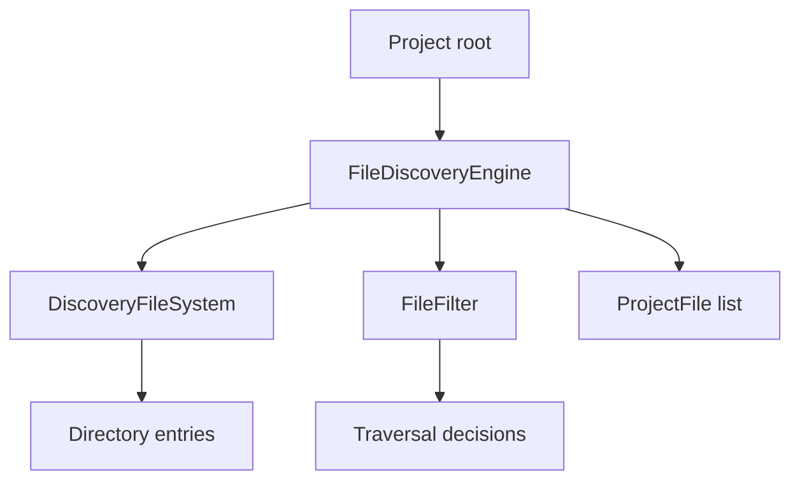
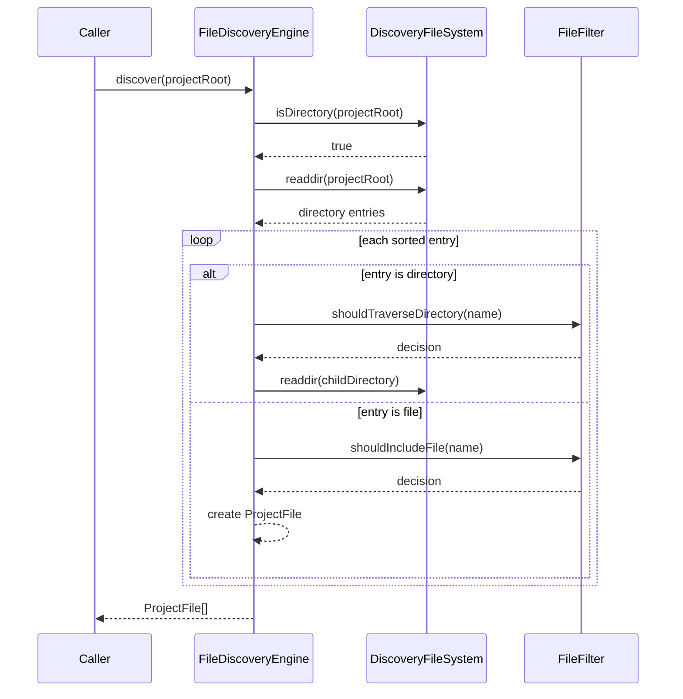

# File Discovery

Status: Accepted  
Author: ui-audit maintainers  
Created: 2026-07-11  
Discussion: docs/architecture.md

## Summary

The File Discovery Engine recursively scans a project root and returns typed
project file metadata for later stages. It is responsible for traversal,
directory filtering, deterministic ordering, and testable filesystem access. It
does not parse source code, evaluate rules, or report findings.

## Motivation

Every audit begins by deciding which files are candidates for analysis. If file
discovery is embedded in parsing or scanning, ignore behavior becomes difficult
to test and expensive mistakes happen early. A separate discovery layer lets
ui-audit avoid dependency folders, build outputs, caches, and irrelevant system
files before heavier work begins.

## Goals

- Accept a project root and recursively discover candidate files.
- Return typed file metadata suitable for parser input.
- Ignore common generated, dependency, and cache directories.
- Keep traversal asynchronous.
- Make filesystem behavior injectable for tests.
- Keep filtering policy separate from traversal mechanics.
- Preserve deterministic output ordering.

## Non-goals

- Parsing file contents.
- Applying audit rules.
- Resolving advanced glob semantics.
- Loading configuration directly.
- Integrating with the CLI.

## Proposed Design

Discovery is split into three concepts:

- `ProjectFile`: immutable metadata about a discovered file.
- `FileFilter`: policy for deciding which directories and files are relevant.
- `FileDiscoveryEngine`: traversal logic that uses a filesystem adapter and
  filter.



## Sequence



## Directory Filtering

The default ignored directories are:

- `node_modules`
- `dist`
- `build`
- `coverage`
- `.git`
- `.next`
- `.cache`
- `storybook-static`

These directories are either dependencies, build artifacts, coverage reports,
framework caches, or generated static outputs. Skipping them improves
performance and reduces false positives.

## Async Implementation

Discovery uses asynchronous filesystem operations so it can later support larger
projects, cancellation, concurrency limits, and integration with responsive CLI
or editor workflows.

## Testability

The engine depends on a filesystem interface rather than directly requiring a
specific runtime in every test. Unit tests can inject a virtual filesystem and
assert traversal decisions without creating large directory structures on disk.

## Separation of Concerns

Filtering is isolated from traversal. This allows future configuration-driven
ignore behavior or extension filtering without rewriting recursive discovery.

## Public API

```ts
import { FileDiscoveryEngine, discoverProjectFiles } from 'ui-audit';

const files = await discoverProjectFiles('/workspace/app');

for (const file of files) {
  console.log(file.relativePath, file.extension);
}

const engine = new FileDiscoveryEngine({
  filterOptions: {
    includeExtensions: ['.tsx', '.vue', '.html'],
  },
});

const uiFiles = await engine.discover('/workspace/app');
```

## Alternatives Considered

### Use a glob library as the core abstraction

Glob libraries are powerful, but they can hide traversal semantics and make
future policy decisions harder to isolate. A direct engine gives ui-audit a
small, explicit boundary. Glob support can still be added above the filter layer
later.

### Let parsers discover files

Parser-owned discovery would duplicate ignore logic across parser
implementations and make project-wide ordering less predictable.

### Synchronous traversal

Synchronous traversal is simpler but can block long-running workflows and limits
future editor integration.

## Drawbacks

- A custom traversal engine must handle path behavior carefully across
  platforms.
- Advanced ignore patterns and glob semantics are deferred.
- Recursive traversal must be monitored for very large repositories.

## Migration Strategy

No migration is required. The discovery layer is a reusable module that future
pipeline stages can adopt when parsing and scanning are introduced.

## Future Possibilities

- Config-driven ignore patterns.
- Include and exclude glob support.
- Concurrency limits for large repositories.
- Symlink policy.
- Monorepo package boundary detection.
- Incremental discovery using filesystem snapshots.

## Open Questions

- Should hidden directories other than known generated folders be traversed by
  default?
- How should symlink loops be detected and reported?
- Should discovery normalize paths to POSIX separators for cross-platform report
  stability?
