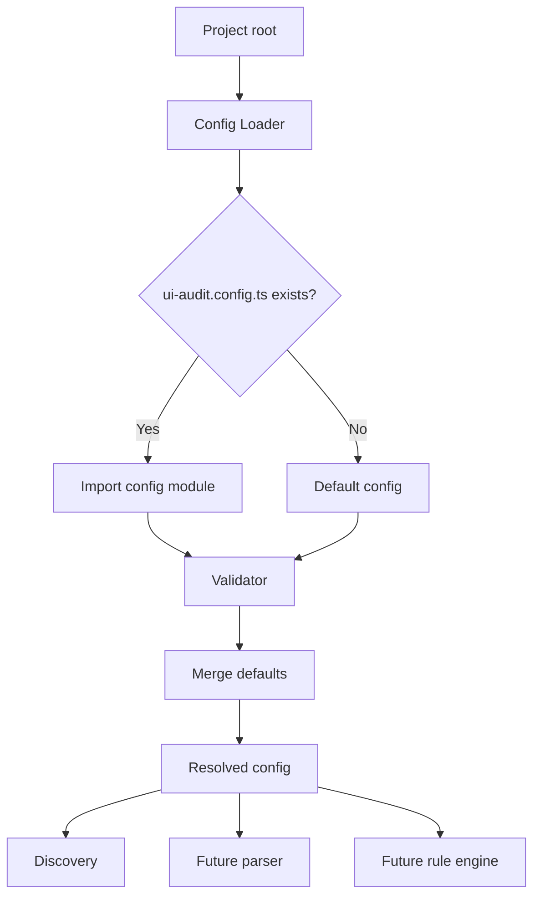

# Configuration System

Status: Accepted  
Author: ui-audit maintainers  
Created: 2026-07-11  
Discussion: docs/architecture.md

## Summary

ui-audit uses a typed configuration system that loads project configuration
before discovery, parsing, scanning, or reporting. The system provides
`defineConfig()`, defaults, validation, descriptive errors, and a loader for
`ui-audit.config.ts`.

## Motivation

Configuration is the first point where user intent enters the audit pipeline.
The project needs a clear, typed, and validated configuration model before later
stages can safely decide which files to inspect, which parsers to enable, which
rules to run, and which plugins may participate.

Loading configuration before parsing prevents the parser layer from guessing at
project policy. It also allows invalid user input to fail early with actionable
messages.

## Goals

- Provide a strongly typed configuration interface.
- Support `ignore`, `rules`, parser options, and future plugin declarations.
- Offer a `defineConfig()` helper similar to Vite.
- Merge user configuration with stable defaults.
- Validate rule severities and structural fields.
- Return descriptive configuration errors.
- Support only `ui-audit.config.ts` initially.
- Keep loader, defaults, validation, and type definitions separate.

## Non-goals

- CLI integration.
- Environment variable or package.json configuration.
- Parser implementation.
- Rule execution.
- Plugin loading.
- Full schema language or runtime type generation.

## Proposed Design



### Type Definitions

The public configuration type describes user-authored configuration. The
resolved configuration type describes the normalized form consumed by later
pipeline stages.

### `defineConfig()`

`defineConfig()` returns the provided object while preserving type inference.
This mirrors the ergonomics used by Vite and other modern TypeScript tooling.

### Defaults

Defaults provide safe behavior for projects without a config file. They include
common ignored directories, parser extension hints, and empty rule/plugin maps.

### Validation

Validation checks that:

- The exported config is an object.
- Rule severities are one of `off`, `info`, `warning`, or `error`.
- `ignore` is an array of non-empty strings.
- Parser options have valid shapes.
- Plugin entries are strings or named objects.
- Unknown top-level keys are reported.

Validation returns structured issues and the assertion helper throws a typed
configuration error. This avoids generic exceptions and gives callers stable
diagnostics.

### Loader

The loader accepts a project root, resolves `ui-audit.config.ts`, and returns a
merged resolved configuration. If the file is absent, it falls back to defaults.
If the file fails to import, the loader throws a typed load error.

## Public API

```ts
import { defineConfig } from 'ui-audit';

export default defineConfig({
  ignore: ['fixtures', 'storybook-static'],
  rules: {
    'a11y/button-name': 'error',
    'layout/no-overlap': 'warning',
    'perf/no-large-image': 'off',
  },
  parserOptions: {
    extensions: ['.tsx', '.vue', '.html'],
    jsx: true,
    typescript: true,
    options: {
      framework: 'react',
    },
  },
  plugins: [
    '@ui-audit/react',
    {
      name: '@ui-audit/vue',
      options: {
        version: 3,
      },
    },
  ],
});
```

```ts
import { loadConfig, validateConfig } from 'ui-audit';

const config = await loadConfig(process.cwd());

const validation = validateConfig(
  {
    rules: {
      'a11y/button-name': 'warning',
    },
  },
  { projectRoot: process.cwd() },
);

if (!validation.ok) {
  console.error(validation.errors);
}
```

## Why Configuration Loads Before Parsing

Parsing is expensive and policy-sensitive. Configuration determines which files
are ignored, which parser hints are enabled, which rules are active, and which
future plugins may contribute parser behavior. Loading and validating
configuration first ensures that later stages run with explicit user intent.

## Alternatives Considered

### JSON-only configuration

JSON is easy to parse safely but cannot express typed helper ergonomics or
future computed configuration. TypeScript configuration is familiar to modern
frontend tool users.

### CLI flags as primary configuration

CLI flags are useful for overrides but poor as the source of durable project
policy.

### Validator inside the loader

Combining loader and validation would reduce files but make testing and future
schema evolution harder. Separate responsibilities keep the system easier to
maintain.

## Drawbacks

- Loading TypeScript configuration requires runtime support and careful error
  handling.
- Early support for only one filename is intentionally narrow.
- Future plugin configuration may require versioned validation.

## Migration Strategy

No migration is required. Projects without `ui-audit.config.ts` receive defaults.
Future configuration sources should be added through RFCs and should preserve
the resolved configuration contract.

## Future Possibilities

- Config presets.
- Environment-specific overrides.
- Package-level monorepo configuration.
- Plugin-provided config schema extensions.
- Config diagnostics with suggested fixes.
- Typed rule option schemas.

## Open Questions

- What precedence should CLI flags, environment variables, and project config
  use when all are supported?
- Should plugin configuration be keyed by plugin name or remain list-based?
- How should rule-specific options be represented alongside severity?
