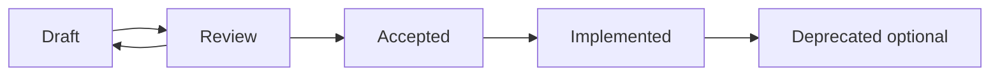

# ui-audit RFCs

RFCs, or Requests for Comments, are design documents for substantial changes to
ui-audit. They describe the problem, proposed design, trade-offs, alternatives,
and long-term implications before implementation begins.

The RFC process exists to make architectural decisions visible, reviewable, and
durable. ui-audit is intended to grow into a broad developer tool with many
rules, parsers, reporters, and plugins. That growth requires a shared record of
why the system is shaped the way it is, not only what the code currently does.

## When to Write an RFC

Open an RFC for changes that affect public contracts, core architecture,
configuration semantics, contributor workflows, plugin capabilities, or major
implementation strategy.

Examples that require an RFC:

- New public APIs or changes to existing public APIs
- Rule engine, parser, reporter, or plugin architecture
- Configuration file format changes
- Cross-cutting performance, security, or compatibility policies
- Deprecations or migration plans for user-facing behavior

Examples that usually do not require an RFC:

- Bug fixes that preserve existing behavior
- Internal refactors with no contract change
- Documentation-only clarifications
- New rules that follow established rule authoring contracts

## Lifecycle



### Draft

The author opens a pull request adding a new RFC file under `docs/rfcs/`.
Draft RFCs should be complete enough to review, but they may still contain open
questions.

### Review

Maintainers and contributors discuss the proposal in the pull request or linked
issue. Review should focus on architecture, user impact, ecosystem impact,
security, performance, and maintainability.

### Accepted

An RFC is accepted when maintainers agree that the design is suitable for
implementation. Acceptance means the direction is approved, not that every
implementation detail is frozen.

### Implemented

An RFC moves to implemented after the relevant code, tests, and documentation
ship. Follow-up implementation pull requests should link back to the accepted
RFC.

### Deprecated

An RFC may be marked deprecated if the decision is superseded by a later RFC or
the project intentionally moves away from the design.

## Authoring Guidelines

Start from `docs/rfcs/RFC_TEMPLATE.md`. A strong RFC is specific, evidence-led,
and honest about trade-offs. It should explain why the change matters, what
constraints shape the design, and what alternatives were considered.

RFCs should:

- State the user or maintainer problem clearly.
- Separate goals from non-goals.
- Include TypeScript examples for public APIs.
- Use Mermaid diagrams for workflows, architecture, or sequencing where useful.
- Describe compatibility and migration strategy.
- List open questions explicitly.
- Avoid implementation-by-accident. The design should be intentional.

## Naming Convention

RFC filenames use a four-digit number followed by a short kebab-case title:

```text
0004-parser-layer.md
0005-rule-engine.md
0006-reporter-contract.md
```

Use lowercase words, hyphens between words, and the `.md` extension.

## Numbering Convention

RFC numbers are assigned monotonically. Do not reuse numbers, even for withdrawn
or deprecated RFCs. The next RFC should use the next available integer in the
`docs/rfcs/` directory, padded to four digits.

`0000` is reserved for project vision and long-term direction.

## Review Process

1. Copy `RFC_TEMPLATE.md` to the next numbered RFC file.
2. Fill in all sections with concrete content.
3. Open a pull request with the RFC only.
4. Link any related issue or discussion.
5. Request review from maintainers responsible for the affected area.
6. Iterate until major concerns are resolved or the proposal is withdrawn.
7. Update `Status:` when the RFC is accepted, implemented, or deprecated.

Maintainers may ask for an RFC to be split if it combines multiple decisions.
They may also ask for an RFC when a pull request introduces architecture or API
changes without prior design review.
