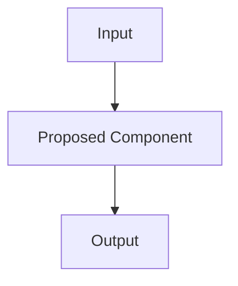

# Title

Status: Draft  
Author:  
Created:  
Discussion:

## Summary

Provide a concise explanation of the proposal and its intended outcome.

## Motivation

Explain the problem this RFC solves, who is affected, and why the project should
address it now.

## Goals

- Describe the concrete outcomes this proposal must achieve.
- Include user, maintainer, and ecosystem goals where relevant.

## Non-goals

- Identify related work that is intentionally out of scope.
- Clarify boundaries so review can focus on the proposed decision.

## Proposed Design

Describe the design in enough detail for reviewers to evaluate the approach and
for future contributors to understand the intended architecture.

Include architecture diagrams where appropriate.



## Public API

Provide TypeScript examples for any public API, configuration shape, extension
point, or contributor-facing contract.

```ts
import { defineConfig } from 'ui-audit';

export default defineConfig({
  rules: {
    'example/rule': 'warning',
  },
});
```

## Alternatives Considered

Describe viable alternatives and why they were not selected. Include the
trade-offs, not only the conclusion.

## Drawbacks

Explain the costs of the proposal, including complexity, migration burden,
performance impact, security considerations, or contributor experience risks.

## Migration Strategy

Describe how existing users, contributors, and integrations move to the proposed
design. If no migration is required, state why.

## Future Possibilities

Document extensions this design enables but does not implement immediately.

## Open Questions

- List unresolved questions that reviewers should help answer.
